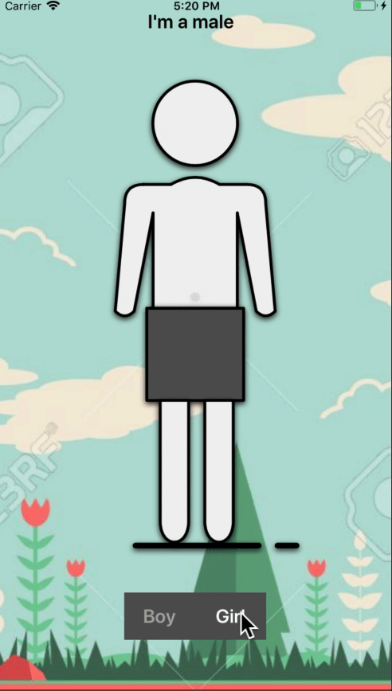

# QUGenderView

[](https://travis-ci.org/etDev24/QUGenderView)
[](https://cocoapods.org/pods/QUGenderView)
[](https://cocoapods.org/pods/QUGenderView)
[](https://cocoapods.org/pods/QUGenderView)

## Example

To run the example project, clone the repo, and run `pod install` from the Example directory first.

## Requirements

## Installation

QUGenderView is available through [CocoaPods](https://cocoapods.org). To install
it, simply add the following line to your Podfile:

```ruby
pod 'QUGenderView'
```

## Overview


This view and its layer create a 2D animation upon gender selection.
It gives a call back completion handler which inform whether user select `male` or `female`

## GenderView
`GenderView` is the main class which holds all control of animation as well as user interaction on gender selection.
you can user this class in few steps. Initializer method of `GenderView` takes a color as parameter which is the clothing color of `male` and `female`.


    let genderView = GenderView(frame: self.view.frame, andColor: UIColor.darkGray)
    self.view.addSubview(genderView)

You can customise this view with your custom `UI-Design` techniques. There are few attributes that you need to set.

To set the `Boy` and `Girl` button's background color you should assign your color to the property of `GenderView` object of name `genderButtonColor`.

    genderView.genderButtonColor = .white

To set the selection `textColor` of both buttons you need to assign a `selectedButtonColor` of `GenderView`

    genderView.selectedButtonColor = .lightGray

To register a callback method so you may know which gender is selected you should call below method with completion handler. This completion handler brings the selected gender type as enumeration of type `GenderType`. You can use it like this.

    genderView?.genderIsSelected(completion: { (selectedGenderType: GenderType) in
        //This completionHandler will call whenever user tap on Boy/Girl button.
    }) 


## Additional Control.
You can additionally control the `topLabel`, and both `Boy` and `Girl` buttons as `maleButton` & `femaleButton`

### GenderType
`GenderType` is a `Swit enum` inherit from `String`. Below is the declaration sample of this swift `enum`

```
public enum GenderType: String {
    case male = "male"
    case female = "female"
}
```

## Contribution
### Syed Qamar Abbas `Author`
* [Syed Qamar Abbas - Facebook](https://www.facebook.com/syedqamar.a)
* [Muhammad Umair - Facebook](https://www.facebook.com/umair.sharif99)
* [Adnan Ahmed Janjua - Facebook](https://www.facebook.com/adnanahmadjanjua)


## License

QUGenderView is available under the MIT license. See the LICENSE file for more info.
